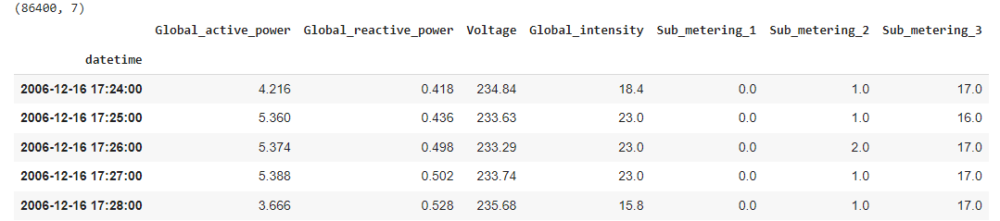

# Forecasting With TensorFlow: Comparing Model Architectures 2

# Introduction

The case has taken [the Forecasting With TensorFlow Approach](https://www.notion.so/Forecasting-With-TensorFlow-Comparing-Model-Architectures-23c48e9fed3c4791a97ec33467f1a2dc?pvs=21) without base modeling and applies new data.

The case analyses the forecasting performance using several different model types. Each model uses the same final two DNN layers with dropout - one of 128 units, and the last layer of 24 (the output horizon).

The case includes analyzing the following approaches:
* A three-layer DNN (one layer plus the common bottom two layers)
* A CNN with two layers of 1D convolutions with max pooling.
* An LSTM with two LSTM layers.
* A CNN stacked LSTM with layers from models 2 and 3 feeding into the standard DNN layer.
* A CNN-stacked LSTM with a skip connection to the standard DNN layer.

The case calling all DataSet before slicing, 

Windowing: For comparison use the date by the last 3 days (72 hours) to predict the next day (following 24 hours) and the 5 features.

# Data

Individual household electric power consumption. Total 86,400 records.

Variables:
  `global_active_power`: total active power consumed by the household (kilowatts).
  `global_reactive_power`: total reactive power consumed by the household (kilowatts).
  `voltage`: Average voltage (volts).
  `global_intensity`: Average current intensity (amps).
  `sub_metering_1`: Active energy for kitchen (watt-hours of active energy).
  `sub_metering_2`: Active energy for laundry (watt-hours of active energy).
  `sub_metering_3`: Active energy for climate control systems (watt-hours of active energy).

# **Model Configurations**

Each model uses the ‘common’ 128 and 24-unit layers with dropout.

The default model parameters are:
  `n_steps`: last 30 days
  `n_horizon`: next 24 hours
  `learning_rate`: 3e-4
  `n_epochs`: 150 epochs.
  `loss = tf.keras.losses.Huber()`
  `optimizer = tf.keras.optimizers.Adam(lr=lr)`
  `activation='relu’`
  `metrics=['mae']`

# Materials links

Dataset: [https://storage.googleapis.com/download.tensorflow.org/data/certificate/household_power.zip](https://storage.googleapis.com/download.tensorflow.org/data/certificate/household_power.zip)
GitLab to [Original case](raw_githubusercontent_com_MWFK_TimeSeries_Sequence_with_TensorFlow_main_9_Notebook7Code_with_Notebook8Dataset.ipynb)
Original link: [https://github.com/MWFK/TimeSeries_Sequence_with_TensorFlow/blob/main/9. Notebook7Code_with_Notebook8Dataset.ipynb](https://github.com/MWFK/TimeSeries_Sequence_with_TensorFlow/blob/main/9.%20Notebook7Code_with_Notebook8Dataset.ipynb)

# Content List

**DNN**
A single layer with 128 units 

**CNN**
Two Conv 1D layers with 64 filters each, and kernel sizes of 6 and 3 respectively. 
After each Conv1D layer a maxpooling1D layer with a size of 2. 

**LSTM**
Two LSTM layers with 72 and 48 units each. 

**CNN and LSTM Stacked**
Using the same layers from the CNN and LSTM model, stack the CNN as input to the pair of LSTMs.

**CNN and LSTM with a SKIP connection**
The same CNN and LSTM layers as the previous models, but with a skip connection direct to the common DNN layer.

# **Evaluation of Training/Validation Results**

All models show close values. LSTM_Skip has a bad result on the first epochs. CNN shows overfitting after 25 epochs. LSTM after 50 epochs.
In general, we can note the acceptable behavior of CNN and LSTM.

