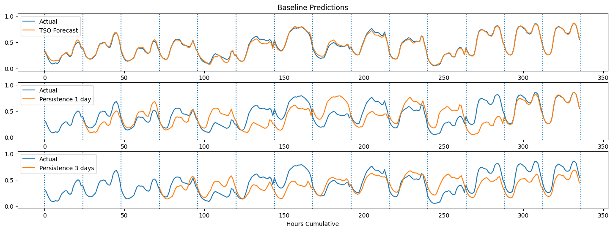

# Forecasting With TensorFlow: Comparing Model Architectures

# Introduction

The models in the case use multiple input variables of past energy load, price, hour of the day, day of the week, and month. It does not use weather inputs. The implementation is also nearly all in TensorFlow, with the exception of data prep and plotting.

The case analyses the forecasting performance using several different model types. Each model uses the same final two DNN layers with dropout - one of 128 units, and the last layer of 24 (the output horizon).

The case includes analyzing the following approaches:
* A three-layer DNN (one layer plus the common bottom two layers)
* A CNN with two layers of 1D convolutions with max pooling.
* An LSTM with two LSTM layers.
* A CNN stacked LSTM with layers from models 2 and 3 feeding into the standard DNN layer.
* A CNN-stacked LSTM with a skip connection to the standard DNN layer.

Each model is compared against baseline persistence models consisting of a one-day and three-day average persistence. Added to the baseline error is the Transmission Service Operator's error.

The original work was extended by plotting for baselines. Were added 2 additional scaling kinds of research.

Windowing: For comparison use the date by the last 3 days (72 hours) to predict the next day (following 24 hours) and the 5 features.

# Dataset Overview

**Context**
In a [paper released in early 2019](https://arxiv.org/abs/1906.05433), forecasting in energy markets is identified as one of the highest leverage contribution areas of Machine/Deep Learning toward transitioning to a renewable-based electrical infrastructure.

**Content**
This dataset contains 4 years of electrical consumption, generation, pricing, and weather data for Spain. Consumption and generation data was retrieved from [ENTSOE a public portal](https://transparency.entsoe.eu/dashboard/show) for Transmission Service Operator (TSO) data. Settlement prices were obtained from the Spanish TSO [Red Electric España](https://www.esios.ree.es/en/market-and-prices). Weather data was purchased as part of a personal project from the [Open Weather API](https://openweathermap.org/api) for the 5 largest cities in Spain and made public here.

**Acknowledgments**
[This data](https://www.kaggle.com/datasets/nicholasjhana/energy-consumption-generation-prices-and-weather) is publicly available via ENTSOE and REE and may be found in the links above.

# Materials links

Dataset: [https://www.kaggle.com/datasets/nicholasjhana/energy-consumption-generation-prices-and-weather](https://www.kaggle.com/datasets/nicholasjhana/energy-consumption-generation-prices-and-weather)
Link to [Original with additional baselines plotting](multi_variate_time_series_forecasting_tensorflow_baseline.ipynb)
Link with [True Independent scaling applied after splitting (each slice for own values)](multi_variate_time_series_forecasting_tensorflow_independanly_scaling_2.ipynb)
Link with [Independent scaling base by training values applied after splitting](multi_variate_time_series_forecasting_tensorflow_test_set_scaling.ipynb) 
Link to [original case and notebook without baselines plotting](multi_variate_time_series_forecasting_tensorflow.ipynb)
Original link: [https://www.kaggle.com/code/nicholasjhana/multi-variate-time-series-forecasting-tensorflow](https://www.kaggle.com/code/nicholasjhana/multi-variate-time-series-forecasting-tensorflow)

# Content List

# Dataset transformation

In case uses `tf.datasets` to prepare the data. The general strategy in the original case is to 1. clean, 2. scale, and 3. split the data before creating the `tf.dataset` object. 
As you can see scaling original work happens before splitting, which may follow to leak of information about verification and validation datasets during training sessions.

In reason to research how scaling can affect the presented models, I added modified reproductions where changed the order of 2. split and  3. scale operations and applied different datasets for finding maximum and minimum values during 2. scaling operation. The result of this study is presented immediately after the analysis of the reproduction of the original case. 

* Cleaning data: Fill any missing values with a linear interpolation of the value. The same was done in the persistence dataset.
* Scaling data: In all cases, the data is min-max scaled.
    * Original paper: MinMax  scaling defined for the full dataset before splitting (training + verification + validation): `get_minmax(full_df )`
    * Independent MinMax scaling applied after splitting. For MinMax uses appropriate dataset: `get_minmax(training_df )`; `get_minmax(test_df)`; `get_minmax(validation_df)`
    * Training MinMax scaling applied after splitting. For MinMax finding uses appropriate datasets: `get_minmax(training_df )`; `get_minmax(training_df )`; `get_minmax(training_df )`
* Features: As part of this simple analysis of models two feature sets are prepared. The univariate contains energy consumption data only. The multivariate contains energy consumption, price, day of the week, and month of the year.
* Splitting data: One year of test data (8769 hourly samples) is put aside to evaluate all the models. The train and validation sets are created with a 65/35 split, resulting in 9207 validation samples - just over one year.

# Baseline Error Performance

In order to compare model performance original work estimates of Bayes limit for the problem uses the following:
  * ENTSOE recorded forecast. This is the collection of models used by the relevant energy authority.
  * Persistence 1 day. Using the observed values from the previous days as the prediction of the next day.
  * Persistence 3-day mean. Using the observations from the previous 3 days as the prediction of the next day.

    **Method                        MAE           MAPE**
0  TSO Forecast                0.015456    5.472781
1  Persistence 1 Day         0.106903    65.951647
2  Persistence 3 Day Avg  0.115176    84.151898
The average error in MW for TSO Forecast is 443.76

MAE errors are interpreted in the work as the number of megawatts (MW) power deviation on average across the whole dataset. So, the TSO forecast is an average of 443.76 MW of error. MAPE is the average percentage deviation of the forecast per time period. In this case about a 5.4% deviation.

# **Model Configurations**

Each model uses the ‘common’ 128 and 24-unit layers with dropout.
The default model parameters are:

`n_steps`: last 30 days
`n_horizon`: next 24 hours
`learning_rate`: 3e-4
`n_epochs`: 150 epochs.

`loss = tf.keras.losses.Huber()
optimizer = tf.keras.optimizers.Adam(lr=lr)
activation='relu’
metrics=['mae']`

**DNN**
A single layer with 128 units 

**CNN**
Two Conv 1D layers with 64 filters each, and kernel sizes of 6 and 3 respectively. 
After each Conv1D layer a maxpooling1D layer with a size of 2. 

**LSTM**
Two LSTM layers with 72 and 48 units each. 

**CNN and LSTM Stacked**
Using the same layers from the CNN and LSTM model, stack the CNN as input to the pair of LSTMs.

**CNN and LSTM with a SKIP connection**
The same CNN and LSTM layers as the previous models, but with a skip connection direct to the common DNN layer.

# **Evaluation of Training/Validation Results**

All models show a flat validation curve while training continues to decline. The best results show `CNN`. 

The `lstm_skip` has a point around epoch 75 where the validation loss stops decreasing, `lstm` has this point at 15. Around 85 epochs `lstm` returns NaN. Around epoch 135 `lstm_skip` has outliers by metrics for the `lstm_skip` model.  
Some options to help improve this can be to introduce learning rate decline or train on longer input sequences.

What is surprising is to see how well both CNN and DNN did on theirs. LSTM would be expected to perform well because of its ability to learn and remember longer trends in the data.

Compared to the baseline results the models' performance was poor. The DNN, CNN, LSTM, and LSTM_CNN models improved against the persistence error (MAE ~ 0.5 - 0.1) but did not improve against the TSO's prediction error (MAE ~0.016, MW error ~444).

**Model          MAE          MW_Error**
DNN            0.091975   2,640.787985
CNN            0.045313   1,301.038219
LSTM           0.1003       2,879.815547
LSTM_CNN  0.076889   2,207.654472
LSTM_SKIP   0.291316   8,364.29437

**Method                        MAE           MAPE           MW_Error**
TSO Forecast                0.015456    5.472781      443.774231
Persistence 1 Day         0.106903    65.951647    3,069.409717
Persistence 3 Day Avg  0.115176    84.151898    3,306.944927

The average error in MW for TSO Forecast is 443.77
The average error in MW for CNN Forecast is 1,301.04

# Compare different scaling results

## Independent scaling

Using of independent scaling follows dramatic changes in results, especially for validation metrics.
We can see overfitting in the early phases of all models. **The problem probably in the heterogeneity of normalization.**
LSTM start providing NAN on 82 epochs, so that is close to the figures received for full dataset scaling (85). 

What is surprising is to see how well both CNN and DNN did on theirs. LSTM would be expected to perform well because of its ability to learn and remember longer trends in the data.

**Independent scaling**
**Model          MAE          MW_Error**
DNN            0.099682  2,862.080065
CNN            0.083609  2,400.594395
LSTM           0.1014      2,911.414632
LSTM_CNN  0.089783  2,577.869663
LSTM_SKIP   0.187710  5,389.562531

**Full dataset scaling**
**Model          MAE          MW_Error**
DNN            0.091975   2,640.787985
CNN            0.045313   1,301.038219
LSTM           0.1003       2,879.815547
LSTM_CNN  0.076889   2,207.654472
LSTM_SKIP   0.291316   8,364.29437

**Method                        MAE           MAPE           MW_Error**
TSO Forecast                0.015456    5.472781      443.774231
Persistence 1 Day         0.106903    65.951647    3,069.409717
Persistence 3 Day Avg  0.115176    84.151898    3,306.944927

The average error in MW for TSO Forecast is 443.77
The average error in MW for CNN Forecast (Full) is 1,301.04
The average error in MW for CNN Forecast (Sep) is 2,400.59

## Scaling by training values

Using scaling based on training in all datasets shows results closer to or the same as scaling based on the full datasets. 

Was made the additional checking of the notebooks and running history. As a result, we can see that independent scaling of each data slice (train, test, validation) based only on the training data scaling values did not affect the results in this case.

**Scaling base by Training**
**Model          MAE          MW_Error**
DNN            0.091975  2,640.787985
CNN            0.045313  1,301.038219
LSTM           0.1003      2,879.815547
LSTM_CNN  0.076889  2,207.654472
LSTM_SKIP   0.291316  8,364.294370

**Full dataset scaling**
**Model          MAE          MW_Error**
DNN            0.091975   2,640.787985
CNN            0.045313   1,301.038219
LSTM           0.1003       2,879.815547
LSTM_CNN  0.076889   2,207.654472
LSTM_SKIP   0.291316   8,364.29437

**Method                        MAE           MAPE           MW_Error**
TSO Forecast                0.015456    5.472781      443.774231
Persistence 1 Day         0.106903    65.951647    3,069.409717
Persistence 3 Day Avg  0.115176    84.151898    3,306.944927

The average error in MW for TSO Forecast is 443.77
The average error in MW for CNN Forecast (Full) is 1,301.04
The average error in MW for CNN Forecast (Train) is 1,301.04

The best results show `CNN`. 

The `lstm_skip` has a point around epoch 75 where the validation loss stops decreasing, `lstm` has this point at 15. Around 85 epochs `lstm` returns NaN. Around epoch 135 `lstm_skip` has outliers by metrics for the `lstm_skip` model.  
Some options to help improve this can be to introduce learning rate decline or train on longer input sequences.

Compared to the baseline results the models' performance was poor. The DNN, CNN, LSTM, and LSTM_CNN models improved against the persistence error (MAE ~ 0.5 - 0.1) but did not improve against the TSO's prediction error (MAE ~0.016, MW error ~444).

## Different scaling resume

Using independent scaling based on the values of each of the slices leads to heterogeneity of normalization and a significant deterioration in the results. I tend to reject this approach.

Independent scaling of each data slice (train, test, validation) based on the same training data scaling values did not affect the prediction results, the reason may be the full data structure and/or structure of the used sample data.

However, I tend to use the scaling based on data from the training dataset and to apply it independently to all slices (training, test, validation) instead of skalling a full dataset, before splitting it into slices.

I can see a minimum of two reasons to do that:
  1. Minimization of any possible effect on the testing and validation phases and provide maximum objective metrics results.
  2. Prediction results have not deteriorated