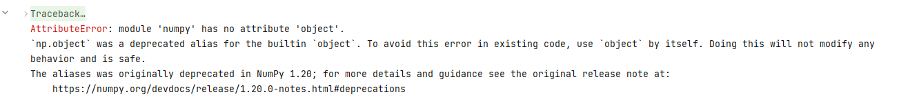

# Retail sales forecasting: Light Gradient Boosting Machine

The result is presented as a review of the original Jupiter notebook. [IPYNB file: jajokine_Business-Cases_main_sales_forecasting.ipynb](https://gitlab.com/daws-backtesting/forecasting/-/blob/4c9ccb9e4f0febe36a3eaa3eaa4839abc3577af3/TestProjects/Retail%20sales%20forecasting%20Light%20Gradient%20Boosting%20Machine/jajokine_Business-Cases_main_sales_forecasting.ipynb)
Reproducing did not possible:

# Dataset

Used Dataset from the following competition: [M5 Forecasting - Accuracy: Estimate the unit sales of Walmart retail goods](https://www.kaggle.com/competitions/m5-forecasting-accuracy)
In the challenge, was tasked to predict item sales at stores in various locations for two 28-day time periods. Information about the data is found in the [M5 Participants Guide](https://mofc.unic.ac.cy/m5-competition/).

## **Files**

`calendar.csv` - Contains information about the dates on which the products are sold.
`sales_train_validation.csv` - Contains the historical daily unit sales data per product and store `[d_1 - d_1913]
sample_submission.csv` - The correct format for submissions. Reference the [Evaluation](https://www.kaggle.com/c/m5-forecasting-accuracy/overview/evaluation) tab for more info.
`sell_prices.csv` - Contains information about the price of the products sold per store and date.
`sales_train_evaluation.csv` - Includes sales `[d_1 - d_1941]` (labels used for the Public leaderboard)

# Chosen model

The paper took Light Gradient Boosting Machine (LGBM), which is a decision tree-based ensemble technique that is able to capture complex, non-linear patterns, that also scale well to large datasets with many variables.
A benefit was declared as that we can incorporate all the variables together, and forecast multiple time series with a single machine learning model instead of choosing the right variables and the right amount of lag for each store separately.
By using an ensemble technique that utilizes boosting, we are able to take advantage of the average of multiple weaker models.

# Data processing and review

Much attention is given to data analysis. Inference and data manipulation is overloaded and can be generalized. In general, as part of working with data, the following actions are performed.

Data actions:
* measuring the amount of memory occupied by data;
* reducing memory consumption by using different dtypes (ranging from 8 to 64 depending on the number of integers they have, so they iterated for the types from the smallest to the largest in order to save memory);
* dataset merging: Combine sales, calendar, and prices by merging all together;
* divided the monthly sales into three components that consist of the trend, seasonal, and what has left afterward the residual. Dickie-Fuller testing;
* Correlation: built correlation graphic between the different variables;
* Feature Engineering (defining components):
  * Autoregressive (AR) components;
  * Moving Average (MA) components;
  * Trend components;
  * Seasonal components;
* Exogenous variables by comparing the daily price information with the prices of different products in the same product category we are able to capture the competition between the different trademarks and companies that set price changes that affect consumer demand
* Relative price counting - compare the prices and their changes with relative prices
  * by comparing the price changes of a product
  * by comparing the prices of a product relative to the different stores
  * by comparing the prices of similar products in the same sto

# **Modeling**

Used the Light Gradient Boosting Machine (LGBM Regressor) which is a decision tree-based ensemble technique.
Trained one model for each store and the variables trained in different steps, where was added a new component at each step, and then see which of the components were important in the decision-making of the forecast.
For the variables, we started from the 56th day, since that's when the lag terms started to calculate values from the previous events.
For the training, used the trees act as Random Forests so that each tree selected a random sample of the training samples and a random subset of the features for each training session. Then, was used boosting, each tree was built upon the forecast of the previous tree, and the model stopped training once the forecast hadn't been improving for some time.
During training used Root Mean Squared Error (RMSE). RMSE is the root of the average squared difference between the actual and predicted values.
After training the model computed the errors with the Mean Absolute Error (MAE). MAE is the mean absolute difference between the actual and predicted values.
Finally, LGBM - being a tree-based model -, sow which of the features was more important than others at each step when the trees made their decisions. (for fine-tuning the best model).

# Analyzing the Results

With a total sales forecast for 1.23M products, the model was able to forecast almost all the future sales with a very high accuracy that only missed 27 sales of the actual total sales on average for each store.
A closer look at the stores revealed, that the biggest spike of errors occurred with the 2nd Store and 3rd store in California, and to some extent with the 2nd store in Texas and Wisconsin.
In the SARIMAX type of linear model, the residuals are often examined to see if the fit can be improved. However, with boosting, the LGBM is able to fit a series of models in which each successive model seeks to minimize the error of the previous model. This leads to the very low residual error that we just saw. We can also see that the residuals look like white noise in that the residuals contain no further information about the dependencies in the data. Moreover, the residuals have a zero mean, the same variance, and are not correlated in time.

# **Grid Search Cross-Validation (Model fitting)**

Used a grid search that conducts an exhaustive search over all the combinations of the chosen hyperparameters related to overfitting, and combined it together with a K-fold Time Series -split for cross-validation.
Split this way, enables the data to have fixed time intervals and the successive training sets to be supersets of those that come before them.

The forecast was performed similarly as before, by conducting a separate forecast for each store but this time was added more regularization for the features as well as random sampling of the features.
This forces the model to try different sets of features and thus helps with not getting overfitted.

# Drawing Conclusions

The goal was to forecast 28 days of sales for 10 stores located in 3 States in the US. After first creating relevant features to extract sales patterns from the past, the LGBM model was able to reach an accuracy that predicted on average almost all future sales with an absolute error rate of only missing on average 27 sales out of total sales of 1,231,764.

The results were then cross-validated with a 5 k-fold which also enabled fine-tuning the regularization terms of the model. This led to the RMSE decreasing further to an average error of 0.00979 with an absolute forecast error of 24 sales on average.

The LGBM model thus offers a powerful way to forecast accurately when dealing with large and complicated datasets.
