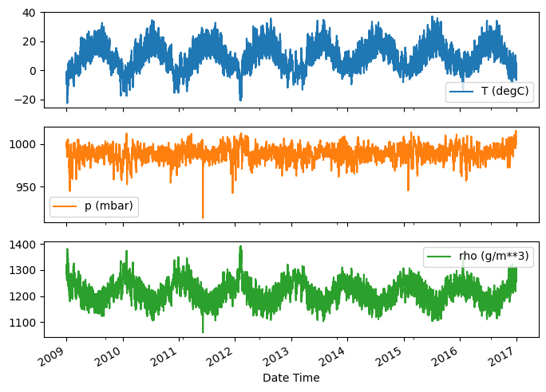

# TensorFlow Time Series Tutorial Reproducing

Reproducing business cases of forecasting models in Time Series

The results are presented by two independent experiments:
1. Directly reproducing the tutorial  
2. Reproducing with different data preparation, cleaning, and feature engineering

## Description

The original tutorial link: [TensorFlow Time Series Tutorial](https://www.tensorflow.org/tutorials/structured_data/time_series?hl=en)

The tutorial provides a solution for windowing, realizations of different models, and their performance, including:
- Single-step models
  - Single-step models with a single output feature, incl.: Baseline, Linear model, Dense, Multi-step dense, Convolution neural network, Recurrent neural network (LSTM)
  - Single-step models with multi-output features, incl: Baseline, Dense, RNN (LSTM), Advanced: Residual connections
- Multiple-time step predictions by Single-shot models (Entire sequence prediction in a single step), incl:
  - Baselines, Linear model, Dense, CNN, RNN (LSTM)
  - Multiple-time step predictions by Autoregressive model with RNN LSTMCell wrapper (AR LSTM)

## Dataset

The dataset has gaps and null values. It must be cleared, normalized, and feature-tuned. Data outliers were analyzed and eliminated, and the dataset was coarsened. For Time and Wind features, feature engineering was applied, calculating sine and cosine components.

[Artifacts](https://gitlab.com/daws-backtesting/forecasting/-/blob/master/TestProjects/structured%20data%20time%20series%20forecasting/time_series_tutorial.ipynb):
- [time_series_tutorial.ipynb](https://gitlab.com/daws-backtesting/forecasting/-/blob/master/TestProjects/structured%20data%20time%20series%20forecasting/time_series_tutorial.ipynb)
- [time_series_second_reproducing.ipynb](https://gitlab.com/daws-backtesting/forecasting/-/blob/master/TestProjects/structured%20data%20time%20series%20forecasting/time_series_second_reproducing.ipynb)

[Other reproduced cases](https://www.notion.so/Business-Cases-of-deep-learning-forecasting-modeling-ccfe7a065b464c8f9393dfc3d35e6638?pvs=21)

# Single-step models with single output feature performance

The result depends on the randomly taken windowing. It seems like a good and stable candidate is the **convolutional neural network that gives from 19% to 29%** increment compared with the baseline **and 4%-7.5% compared with the linear model**. The simple LSTM shows unstable results.

*First tutorial direct reproduction*

- Baseline 100% (0.0852)
- Linear 21.6% (0.0668)
- Dense 26% (0.0630)
- Multi-dense 34.5% (0.0558)
- Conv 29% (0.0604)
- LSTM 39.32% (0.0517)

*Second independent reproduction*

- Baseline (0.7361)
- Linear 15.26% (0.6238)
- Dense -124% (1.648)
- Multi-dense -122.0% (1.634)
- Conv 18.86% (0.5973)
- LSTM 1% (0.7279)

# Single-step models. Multi-output features

**Residual LSTM** shows improvements **from 13% to 27.5%** compared with the baseline. That makes this approach interesting to use. It should be noted that the performance of all models is too unstable. During the second reproduction, LSTM predicted one value during the second independent reproduction.

*First tutorial direct reproduction*

- Baseline: (0.1638)
- Dense 20.88% (0.1296)
- LSTM 25.76% (0.1216)
- Residual LSTM 27.41% (0.1189)

*Second independent reproduction*

- Baseline: (0.7919)
- Dense -40.27% (1.1108)
- LSTM -11604.22% (92.6857)
- Residual LSTM 13.20% (0.6874)

# Multiple-time step predictions performance

Multiple-time step prediction during independent reproduction performance shows an inability of models to provide a better prediction than a linear model. During the first reproduction, the gains achieved going from a dense model to convolutional and recurrent models are only a few percent (if any), and the autoregressive model performed clearly worse. LSTM-based models predicted one value during the second independent reproduction.

*First tutorial direct reproduction*

- Last: 0.5157
- Repeat: 0.3774
- 26.82% to Last
- Linear: 0.2983
- 42.16% to Last
- 57.60% to Repeat
- Dense: 0.2748
- 46.71% to Last
- 63.83% to Repeat
- Conv: 0.2739
- 46.89% to Last
- 64.07% to Repeat
- LSTM: 0.2769
- 46.31% to Last
- 63.28% to Repeat
- AR LSTM: 0.2941
- 42.97% to Last
- 58.72% to Repeat

*Second independent reproduction*

- Last: 3.0998
- Repeat: 2.5897
- 16.46% to Last
- Linear: 2.1667
- 30.10% to Last
- 36.03% to Repeat
- Dense: 2.6681
- 13.93% to Last
- 16.67% to Repeat
- Conv: 2.9746
- 4.04% to Last
- 4.83% to Repeat
- LSTM: 84.3461
- -2621.02% to Last
- -3137.29% to Repeat
- AR LSTM: 18.7582
- -505.14% to Last
- -604.64% to Repeat

# Summary

Stable repetition of the results for the dataset was achieved only in the case of Single-step models. In particular, for Convolutional Neural Networks (CNN) and Residual LSTM (ReLSTM).

Convolutional neural networks provide an increment ranging from 19% to 29% compared to the baseline and 4% to 7.5% compared to the linear model.

In the case of Multiple-time step prediction performance, the results have not been fully reproduced.
