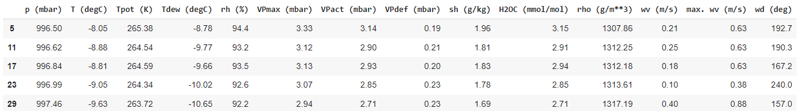

# Multivariate Time Series Analysis and Prediction with TensorFlow

# Description

We will be forecasting for hourly predictions, so subsample to 1-hour intervals.
The case fully repeats the [Tutorial](https://github.com/galkinc/deep-learning-forecasting/tree/main/TensorFlow_Core_Tutorial)
Used the same approach as in the [Tutorial](https://github.com/galkinc/deep-learning-forecasting/tree/main/TensorFlow_Core_Tutorial) to data preprocessing, which can save gapping.

The tutorial provides a solution for windowing, realizations of different models, and their performance including:

- Single-step models with single output feature, incl.: Baseline, Linear model, Dense, Multi-step dense, Convolution neural network, Recurrent neural network (LSTM)
- Single-step models with multi-output features, incl: Baseline, Dense, RNN (LSTM), Advanced: Residual connections
- Multiple-time step predictions by Single-shot models (Entire sequence prediction in a single step), incl:
    
    Baselines, Linear model, Dense, CNN, RNN (LSTM)
    
- Multiple-time step predictions by Autoregressive model with RNN LSTMCell wrapper (AR LSTM)

# Data

Will be using the weather time series dataset recorded by the Max Plank Institute for Biogeochemistry, which contains 14 different features such as air temperature, atmospheric pressure, and humidity. Data was collected every 10 minutes from 2009-2016. 70,091 records.

# Links

Data Set link: [https://storage.googleapis.com/tensorflow/tf-keras-datasets/jena_climate_2009_2016.csv.zip](https://storage.googleapis.com/tensorflow/tf-keras-datasets/jena_climate_2009_2016.csv.zip)

# Single output values

We can see that LSTM shows good results

# **Multi-Output Models**

LSTM shows results close to the Dense-based neural network. 

# **Multi-Step, Multi-Output Predictions**

For the case results CNN shows the same results as LSTM.