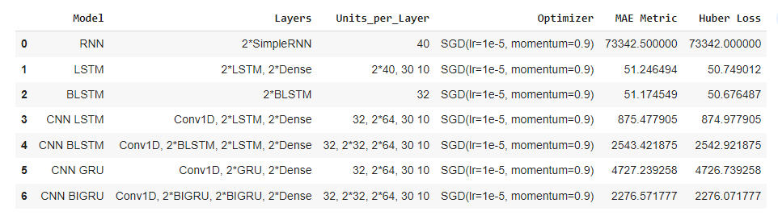

# TimeSeries Sequences Benchmarking Algos

# Introduction

The source code has been developed based on [deeplearning.ai](http://deeplearning.ai/) course materials, [tensorflow.org](http://tensorflow.org/) documentation, and other open-source resources.

The case analyses the forecasting performance using several different model types. Each model uses the same final two DNN layers with dropout - one of 128 units, and the last layer of 24 (the output horizon).

The case includes analyzing the following approaches:
* SimpleRNN (2 SimpleRNN, 1 Dense, and 2 Construction Layers)
* LSTM (2 LSTM and 2 Dense Layers).
* Bidirectional LSTM (2 construction layers, 2 Bidirectional LSTM, 1 Dense layer)
* CNN LSTM (1 CNN, 2 LSTM, 3 Dense) 
* CNN BLSTM (2 construction layers, 1 CNN, 2 Bidirectional LSTM, 2 LSTM, 3 Dense)
* CNN GRU (1 CNN, 2 GRU, 3 Dense, 1 Construction - The output of the layer is three-dimensional)
* CNN BIGRU (1 CNN, 2 GRU, 3 Dense, 2 Constructions)

The case has 32 windows with a size of 30 in each batch, where each window will have one new value each time.

# Data

Monthly Mean Total Sunspot Number, from 1749/01/01 to 2017/08/31. Total **3,264** records.

Variables:
  `record_id`: a record number
  `date`: date of the record
  `value`: monthly Mean Total Sunspot Number

# Summary

The best values show the BLSTM model with 2 BLSTM layers. Classic LSTM model with 2 LSTML and 2 Dense layers shows very close results. The third place was taken CNN LSTM with 1 Conv1D, 2 LSTM, and 2 Dense layers.

LSTM shows more stable results after 110 training epochs. 

# Materials links

Dataset: [https://www.kaggle.com/robervalt/sunspots](https://www.kaggle.com/robervalt/sunspots)
[Link to Original case](raw_githubusercontent_com_MWFK_TimeSeries_Sequence_with_TensorFlow_main_5_TimeSeries_Sequences_Benchmarking_Algos.ipynb)
[Original link](https://github.com/MWFK/TimeSeries_Sequence_with_TensorFlow/blob/main/5-%20TimeSeries_Sequences_Benchmarking_Algos.ipynb)

# Content List

